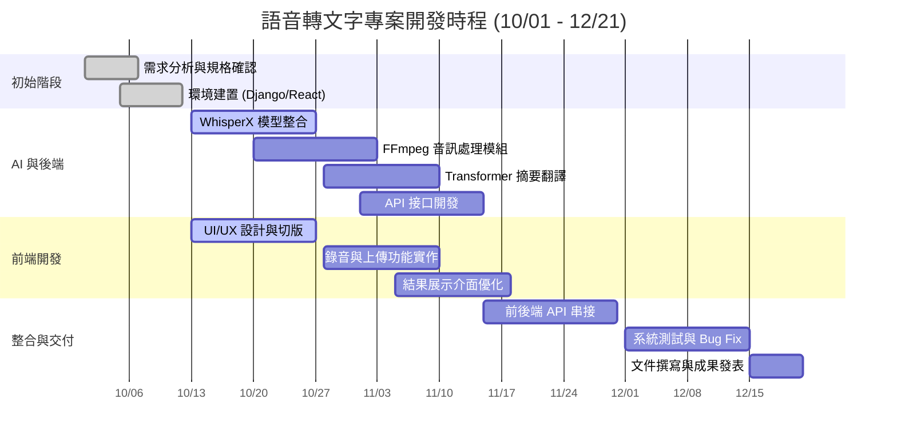
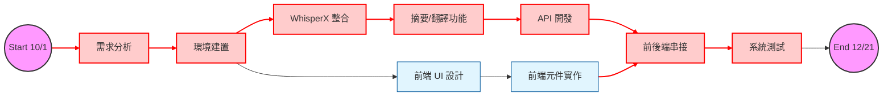

## 📅 專案時程與任務分配 (Project Schedule & Tasks)

### 1. 👥 團隊成員任務分配 (Team Roles)

| 成員 | 角色 (Role) | 負責內容 (Responsibilities) |
| :--- | :--- | :--- |
| **林東毅** | **AI & Backend Core** | • WhisperX 模型整合與優化 • Transformer 摘要與翻譯實作 • 撰寫 AI 處理邏輯 (Service Layer) |
| **張恩豪** | **Frontend (React)** | • React 專案架構與 UI 切版 • 開發錄音、檔案上傳與結果顯示介面 • RWD 行動端適配與互動優化 |
| **蘇子皓** | **DevOps & Integration** | • Django 環境建置與 DRF API 接口開發 • FFmpeg 音訊預處理串接 • 系統整合、除錯與最終部署 |

---

### 2. 📊 專案甘特圖 (Gantt Chart)

